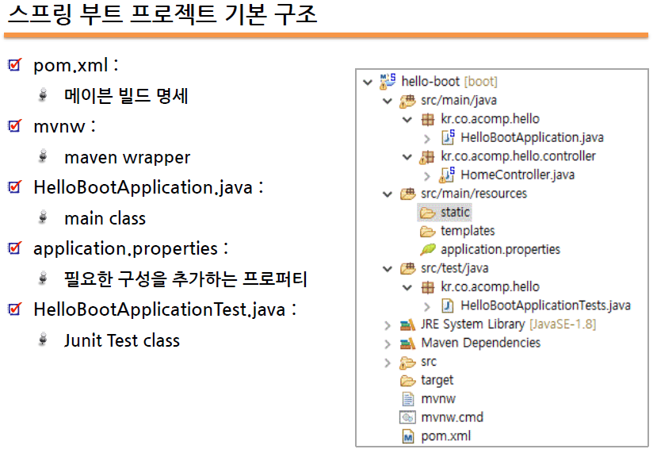
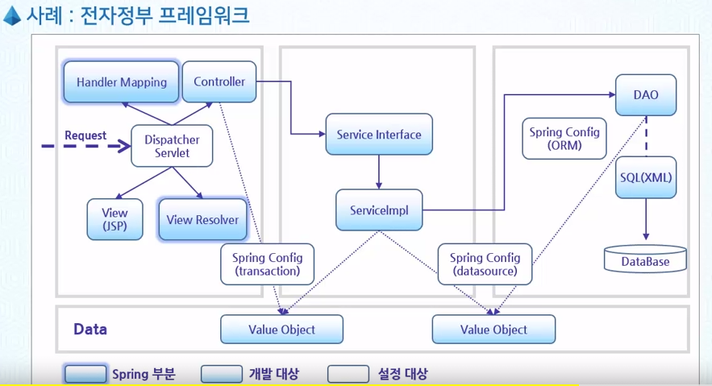
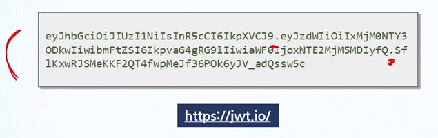

Application Context         
ApplicationContext 생성하기         
ApplicationContext context = new ClassPathXmlApplicationContext("config.xml");          

ApplicationContext 종류     
* ClassPathXmlApplicationContext
* FileSystemXmlApplicationContext
* XmlWebApplicationContext
* AnnotationConfigApplicationContext


스프링 IOC 컨테이너에 적재하기
/*
ApplicationContext applicationcontext = new ClassPathXmlApplicationContext("beans/nexcore-eims.xml");
NjfcIoLayoutRepository bb = applicationcontext.getBean(NjfcIoLayoutRepository.class);
List<Map<String, Object>> list = bb.select(new HashMap());

for(Map map : list) {
  System.out.println(map);
}
*/

https://github.com/soongon/restapp/tree/master/src/main/java/com/acompany/restapp

# 스프링부트 2.0(스프링 5.0)으로 작성하는 RESTful API 서비스  

# 1차 스프링과 스프링부트   

## 스프링 프레임워크 특징   

  1. 컨테이너 역할 (IOC)  
      - Spring컨테이너는 Java 객체의 Life Cycle을 관리하며,   
        Spring컨테이너로 부터 필요한 객체를 가져와 사용할 수 있음.       

  2. DI(Dependency Injection) 지원  
      - Spring은 설정 파일이나 어노테이션을 통해서 객체 간의 의존관계를      
        설정할 수 있도록 하고 있음       

  3. AOP(Aspect Oriented Programming) 지원  
      - Srping은 트랜잭션이나 로깅, 보안과 같이 공통적으로 필요로 하는       
        모듈들을 실제 핵심 모듈에서 분리해서 적용할 수 있음.

  4. POJO(Plain Old Java Object) 지원    
      - Spring컨테이너에 저장되는 Java객체는 특정한 인터페이스를         
        구현하거나, 특정 클래스를 상속받지 않아도 됨     

  5. 트랜잭션 처리를 위한 일관된 방법을 지원  
      - JDBC, JTA 등 어떤 트랜잭션을 사용하던 설정을 통해 정보를 관리하므로      
      트랜잭션 구현에 상관없이 동일한 코드 사용 가능       

  6. 영속성(Persistence)과 관련된 다양한 API지원  
      - Spring은 MyBatis, Hibernate 등 데이터베이스 처리를 위한   
      ORM(Object Relational Mapping) 프레임워크들과의 연동 지원   


# 2차 Spring 개발 환경 설정
리액티브 리액터   
2014 jdk 1.8 많이 바뀌고 람다 도입 모던 랭귀지로 거듭 났다    
1.9 부터는 jdk 9(나인) 이라 부르고  jdk 9(나인)  이전과 이후로 나뉨 모듈이란 개념이 등장    

convention over configuration 구성에 대한 규칙    
Best Practice 모범경영    

스켓폴딩? hello 까지 자동 설정 해 주는거?   

- 스프링 부트 - 차세대 스프링 프레임워크
  - 스프링 기반 production-ready 어플리케이션 개발
  - Convention over configuration을 따름
  - 톰캣이 내장되어 단독으로 실행 가능
  - 설정을 최대한 줄이고 XML 설정파일 필요 없음


## 스프링부트 프로젝트 생성
  1. start.spring.io 접속    
  2. Maven, Gradle 프로젝트 및 언어 선택   
  3. 스프링부트 버전 선택    
  4. 프로젝트 메타정보      
    - Group    : 도메인에 역순으로 지어서 쓴다  
    - Artifact : 프로젝트명  
    - java 버전   
    - Packaging jar, war 선택 jar 로 하게되면 tomcat 이 내장되어 있어, 단독으로 실행이 가능하다.  
    - Dependencies (Web, Spring Web 선택(Spring MVC.))
  5. generate 하면 zip 파일로 다운로드됨
  6. zip 파일을 인텔리제이(IDE툴) 에서 import 한다.   
    - (new -> project -> empty project -> 경로지정 -> 열리고 팝업에서 메이븐 지정)

※ - 스프링5와 스프링 부트는 자바8 이상의 설치가 필요하다    
   - 스프링부트는 베스트 프랙티스에 따라 자동으로 설정을 수행해준다.  
   - tomcat Port 는 /src/main/resources/application.properties 파일에다 server.port = 8085 설정     
     application.properties 파일 설정을 더 알고 싶다면.     
    https://docs.spring.io/spring-boot/docs/current/reference/html/appendix-application-properties.html

## 스프링부트_프로젝트_기본구조
     
  - XXXApplication.java (자동 생성)
    ```java
      @SpringBootApplication // 컴포넌트 구성과 자동 구성
      public class HelloBootApplication{
        public static void main(String[] args){
          SpringApplication.run(HelloBootApplication.class, args);
        }
      }
    ````
  - @SpringBootApplication
    - @Configuartion
    - @ComponentScan
    - @EnableAutoConfiguration

  - 스프링 부트 설정 파일
    - application.properties
      - 선택적인 파일(사용하지 않아아도 됨)
      - 명시적으로 요청하는 부분이 없음
      - spring boot 가 로드되면 자동으로 이 파일을 로드
    - 기존의 XML 설정파일도 가져올 수 있음
      - Application.java 파일에 아래 어노테이션 추가
      - @ImportResource("classpath:spring/root-context.xml")
  
  - 스프링 부트 개발자 툴
    - 스프링 부트 개발모드 지원
      - thymeleaf 등 템플릿에 대한 개발 캐싱을 비활성화 처리  
      - 소스의 변경이 일어나면 스프링 부트 서버가 새로 시작되면 바로 반영   
      - html, css 부분을 변경하면 바로 브라우저에서 감지하여 반영   
        (크롬, 파이어폭스, 사파리에서 "http://livereload.com/extensions/" 플러그인 설치 필요)
    - 간단 설정
      - 디펜던시 추가 : spring-boot-devtools
        ```xml
          <dependency>
            <groupId>org.springframework.boot</groupId>
            <artifactId>spring-boot-devtools</artifactId>
          </dependency>
        ```
  - 스프링 부트 테스트 (jUnit 사용)        
    - 테스트 의존성은 스프링부트 프로젝트 생성 시 자동 추가됨
      ```xml
          <dependency>
            <groupId>org.springframework.boot</groupId>
            <artifactId>spring-boot-starter-test</artifactId>
            <scope>test</scope>
          </dependency>      
      ```
      ```java
        @RunWith(SpringRunner.class)
        @SpringBootTest
        public class HelloBootApplicationTests{

          @Test
          public void contextLoads(){

          }
        }
      ```


# 3차 REST 아키텍처 소개(1)
HTTP 웹 서비스 개요와 RESTful 웹서비스란 무엇인지 알아봅니다.   
Roy Fielding 박사학위 논문에서 제안 되었으며 REST 는 아키텍처 라기 보다는 하나의 규약이다     

- HTTP 
  - 전송 규약으로 사용
  - 인터넷 상에서 데이터를 주고 받기 위한 서버/클라이언트 구조의 프로토콜    
  - 대부분 HTTP 프로토콜을 사용하고 노드들끼리 안쓰는 구간은 
  - 애플리케이션과 데이터베이스 구간 전용프로토콜 드라이버 형태로 전용프로토콜을 사용중이다.
- HTTP 메시지
  - 헤더와 바디로 구성
- HTTP Methods
  - 클라이언트 요청의 종류 
  - 서버는 이 정보를 통해 적당한 응답을 제공

  |Method|Description|
  |:----------:|:----------|
  |GET|자원요청|
  |POST|Entity를 포함한 자원 요청|
  |HEAD|HTTP Header 정보만 수신|
  |TRACE|Request의 루프백 테스트|
  |PUT|URL에 자원을 생성|
  |DELETE|URL의 자원을 삭제|
  |OPTION|응답 가능한 HTTP 메소드를 요청|
  |CONNECT|터널링의 목적으로 연결 요청(프록시에서 사용함)|
  |||

- REST와 SOAP의 차이  
  - SOAP 
    - 동작과 프로세싱에 집중  
    - 규약이 엄격함 
    - 상거래B2B 에서 많이 사용  
    - 데이터 보다는 내부적인 프로세스와 보안에서 사용이 많이 됨   
  - REST 관심은 데이터 처리   

- RESTful 기반 웹 서비스
  - HTTP 프로토콜로 데이터를 전달하는 프레임워크
  - 핵심은 웹에 개발된 리소스 이용    

- REST 아키텍처 스타일에 따라 정의되고 이용됨
  - REST API - 소유자의 자원에 접근할 수 있는 API
  - RESTful 하다 - REST API를 제공하는 웹 서비스

- 테스트 호출 URL https://api.github.com/users/realllbro


# 4차 REST 아키텍처 소개(2)
## REST 원리 및 원칙(제약조건)

REST 원리 및 원칙에 대해서 알아 봅니다.   
Resource와 Representation을 구분할 수 있습니다.   
De-facto Standard 일반?

REST란 Representational State Transfer의 약자이며 데이터의 Representation 전송해 주는 방식이다.   

REST란 무엇인가?
- HTTP를 보다 HTTP 답게 만들기 위한 방법론으로 볼 수 있음 (일반적으로 아키텍처 보단 방법론으로 본다.)
- 철저히 Resource 중심적 설계를 중요시하고 
  - Create - POST
  - Read - GET
  - Update - PUT
  - Delete - DELETE와 같이 HTTP 4가지 메소드를 용도에 맞게 사용

REST 원리 및 원칙(제약조건)   
확장성 있는 웹 서비스를 위한 소프트웨어 아키텍처 적인 접근    
1. Client-Server
    - View와 Data를 분리
    - Portability(이동성)를 향상
    - REST 서버는 Resource를 관리하는 API를 제공
      - 클라이언트는 사용자 인증이나 Context(Session, Login 정보) 직접관리
      - 서버는 UI나 User State에 상관없이 Server 기능에 집중(단순화, 확장성)

2. Stateless 
   - 요청 자체가 같다면 응답도 같아야 한다. input 이 같으면 항상 output이 같아야 한다.  
     (퓨어펑션 함수형 프로그램 핵심적인 컨셉)
   - 클라이언트의 상태를 서버에 저장하지 않음(확장성)
   - 세션정보와 같은 context를 저장할 필요가 없음
   - 클라이언트는 자신을 구분하기 위해 서버에게 충분한 정보를 전달해야 함
      - API Key 또는 Token

3. Cacheable
   - HTTP 프로토콜의 Caching 기능을 적용할 수 있음
     - 웹 서비스의 60~80%가 GET 방식의 요청
     - 구현은 HTTP 프로토콜 표준인 "Last-Modified" 태그나 E-Tag를 이용    

4. Layeredsystem

5. Code on demand(optional) 
   - 서버는 실행 가능한 코드를 클라이언트에게 전송
     - 클라이언트의 기능을 일시적으로 확장하거나 커스터마이징 가능
     - Java Applet, JavaScript가 대표적 예
   - 최근에는 사용안하는 추세    

6. Uniform interface
   - REST의 코어인 리소스는 URI에 의해 식별됨
   - 데이터 구조(data representation)는 강제하지 않음
     (주로 XML 또는 JSON)
   - Uniform Interface 는 다음 4가지로 설명할 수 있음
     1. Resource Identifier -> URI
        - Resource는 서비스나 정보를 제공하는 모든 것들이 될 수 있음
        - 주문, 송장, DB의 레코드, 검색 결과 등
        - 웹 상에서 주소를 통해 접근 될 수 있음
        - 즉, 리소스는 URI를 반드시 가져야 함
        - URI 정의는 동사형이 아닌 명사형으로 정의하도록 권장됨
     2. Resource Representations
        - Resource 는 Unique ID로 하나 이상의 URI뿐만 아니라,   
          다양한 방법으로 설명(대표)되는 Representation을 가질 수 있음
        - Representation 에 대한 접근을 위한 URL을 가지고
        - HTTP 4가지 메서드(POST/GET/PUT/DELETE)를 통해 CRUD 할 수 있음
        - GET 메서드 정의
          - Target resource에 대한 현재의 선택된 representation 하나를 반환함
          - 리소스는 HTTP 요청의 대상이지만, 리소스의 개념을 제한하지 않음
        - Representation 이란?
          - 어떤 리소스의 특정 시점의 상태를 반영하고 있는 정보
          - 다음 두 가지로 구성됨
            - Representation data
            - Representation metadata

     3. Self-Descriptive Message  
        - REST는 Stateless 라서
        - 클라이언트 - 서버 간 충분한 설명적인 메시지가 필요 
            - HTTP 메서드 
            - HTTP 상태코드
            - HTTP 헤더

     4. HATEOAS (Hypermedia As The Engine Of Application State)
        - HATEOAS 메시지를 보내는 것은 어플리케이션의 상태를 변화시킴
        - HTTP 응답에 다음 Action이나 관계되는 리소스에 대한 HTTP Link를 함께 리턴
          - 페이지 처리의 경우 리턴 시, 전후 페이지에 대한 링크를 제공
          - 연관된 리소스에 대한 디테일한 링크를 표시
        - 현재 대부분 적용하고 있지 않음.          

RESTful 하다 라는 의미란?   
API 서비스를 설계하고 운영할 때 Restful 하다는 의미는 다음을 최소한 포함한다.   
1. API의 Endpoint가 오직 하나이다.   
2. 요청을 GET, POST, PUT, DELETE를 다향하게 사용한다.    
3. 요청과 응답에 대한 메타데이터는 HTTP 프로토콜 방식을 사용한다.    
4. URL에 동사(verb)를 포함하지 않는다.   

# 5차 Spring MVC로 RESTful API 서비스 구현
1. Spring MVC에서 RESTful 지원
  - 스프링 MVC에서 RESTful을 지원하는 방법을 알아봅니다.  
  - Spring-Web MVC에서의 RESTful 지원
  - @Controller -> @Component -> 스프링 컨테이너    
    스프링 컨테이너 위에 로딩 되는 객체를 컴포넌트라 부르며 자동적으로 스프링 컨테이너에서 관리를 한다.   
    (@Component 어플리케이션 시작시 로딩되어 스프링 컨테이너에 의해 관리되어 지는 컴포넌트를 의미한다.)   
  - @Controller 와    
    @RequestMapping(value="url", method=POST/GET/DELETE/PUT)    
    @ResponseBody 사용    
    ```java
      @Controller   
      public class IndexController{
        @RequestMapping(value="/", method=RequestMethod.GET)    
        @ResponseBody
        public String index(){
          return "Hello, Boot"
        }
      }
    ```

  - @RestController와 @X-Mapping 사용 (스프링 4.3 이상...)  
  - @RestController = @Controller + @ResponseBody 개념이며 주로 JSON Object 타입으로 결과값을 리턴한다. 
  - @GetMapping(@X-Mapping) = @RequestMapping(value="/", method=RequestMethod.GET)  
    ```java
      @RestController
      public class IndexController{

        @GetMapping("/")
        public String index(){
          return "Hello, Boot";
        }

      }
    ```

2. Layered Architecture
  - 계층화 아키텍처를 의미하는 Layered Architecture를 스프링에서 어떻게 구현하는지 확인합니다.
  - Layered Architecture는 인접한 레이어 간의 통신만 허용하고 반드시 레이어를 거쳐서 통신하는     
    구조를 가진다. 대표적 사례로 OSI7 레이어가 있다.    
  - 효율적인 개발과 유지보수를 위해 계층화하여 개발 
  - 대부분의 중/대규모 어플리케이션에서 적용  
  - 각 레이어는 독립된 R&R을 가짐   
  - Layered Architecture 특징 (Presentation Layer -> Business Logic Layer -> Data Access Layer)   
    - 프레젠테이션 영역 (Presentation Layer) @Controller 영역   
      - 사용자와 상호작용을 담당  
      - 사용자의 요청을 분석/응답   
    - 비즈니스 영역 (Business Logic Layer) @Service 영역   
      - 기능을 수행 
      - 트랜잭션 수행 
    - 데이터 영역 (Data Access Layer) DAO 영역  
      - 데이터의 저장과 조회를 담당 
      - 주로 데이터베이스와 연동하여 작업 
  - Layered Architecture 전자정부프레임워크 사례
    - Controller, Service, DAO 영역을 레이어링 시켜 놨으며 각각의 레이어들 끼리는 ValueObject(VO)를 통해 데이터를 주고 받는다.    
  

  - 컴포넌트 자동등록
    - 컴포넌트는 스프링 컨테이너 위에 로딩되는 객체이며 사용자가 라이프 사이클을 직접 관리 할 수 없고 
      스프링 컨테이너가 객체 생성, 사용을 관리한다.   
    - 어노테이션(Annotation) 사용
      - @Component 와 하위 어노테이션 사용  
                      
      - @Autowired
        - Component 간의 의존관계는 Autowired라는 Annotation으로 적용
        - @Autowired 어노테이션은 DI 기능으로 자동으로 의존관계를 맺어준다.

        
# 6차 REST 에서 CRUD 구현 1
1. RESTful API 서비스에서의 HTTP 메서드 사용    

  - HTTP 메소드  
    - GET   
    - POST    
    - PUT   
    - DELETE          

      |Operation|HTTP Method|
      |:----------:|:----------|
      |Read|GET|
      |Create|POST|
      |Update|PUT|
      |Delete|DELETE|
      |||
  - CRUD 설계   
    - HTTP의 GET, POST, PUT, DELETE를 주로 활용하여 데이터의 CRUD를 구현한다.
    - UserController 생성 : /users  
      - GET   
        - public Map<String, Object> getAllUsers(); 
        - public Map<String, Object> getUser(@PathVariable(“userid”) Integer userid);   
      - POST  
        - public Map<String, Object> createUser();  
      - PUT 
        - public Map<String, Object> updateUser();  
      - DELETE    
        - public Map<String, Object> deleteUser();  
  - Data Transfer Object 디자인 패턴
    - 데이터를 각 서버/클라이언트 간 전달하기 위한 목적으로 만든 객체   
      - java.io.Serializable 인터페이스 : 구현  객체직렬화 지원
      - Immutable 객체로 만듬 : setter 포함하지 않음  
      - 도메인(모델) 객체를 래핑(wrapping))

  - JSON  
    - JSON(JavaScript Object Notation)이란?   
      - http://www.json.org   
      - JSON은 경량(lightweight)의 DATA-교환 형식   
      - JavaScript에서 객체를 만들 때 사용하는 표현식을 의미함
      - JSON 표현식은 사람과 기계 모두 이해하기 쉬우며 용량이 작아서,    
      최근에는 JSON이 XML을 대체해서 데이터 전송 등에 많이 사용함
      - 특정 언어에 종속되지 않으며, 대부분의 프로그래밍 언어에서   
      JSON 포맷의 데이터를 핸들링 할 수 있는 라이브러리를 제공하고 있음   
    - JSON 라이브러리 - Jackson
      - http://jackson.codehaus.org   
      - High-Performance JSON Processor!    
      - Jackson은 JSON 형태를 Java 객체로, Java 객체를 JSON 형태로 변환해주는 Java용 JSON 라이브러리임    
      - 가장 많이 사용하는 JSON 라이브러리임      
  - API 응답 포맷   
    - 요청에 대한 응답의 결과를 상태와 데이터로 구분  
      ```javascript
      {
        "status":"OK",
        "data":{}
      }
      ```
    - 페이징 샘플          
      ```javascript
      {
        "status":"OK",
        "data":{},
        "error"null,
        "pageNumber":1,
        "nextPage":"http://localhost:8080/users?page=2",
        "total":13
      }
      ```      
    - 에러 메시지   
      ```javascript
      {
        "status":"ERROR",
        "data":null,  
        "error":{
          "errorCode":999,
          "description": "Email address is invalid"
        }
      }
      ```    
2. JSON Data Format, REST(HTTP) 클라이언트
  - REST 클라이언트
    - Postman : REST API 테스트하는 Chrome 확장 프로그램 설치
    - REST 클라이언트는 HTTP에이전트로써 주로 GUI를 통해 HTTP요청을 수행하고    
      응답을 받아 사용자에게는 알려주는 어플리케이션이다.   
      주로 많이 쓰이는 REST 클라이언트로는 Postman, Insomnia, Paw, Katalon Studio 등이 있다.    


# 7차 REST 에서 CRUD 구현 2
1. Controller 와 Service 클래스를 통해 CRUD 를 구현   
2. 스프링 어노테이션을 이용해 HTTP 요청 처리  
  - @PathVariable  
    - @PathVariable 어노테이션은 요청 URL을 파라미터 사용하여 경로변수로 지정할 수 있다.     
    - 요청 URL을 파라미터로 사용(경로변수)    
      - 예) http://cafe.daum.net/sq99/2hq/68443   
        (sq99:카페아이디,  2hq:게시판이름, 68443:게시물에 이름)   
      - 요청 URL : /users/{userid}    
      - 파라미터로 처리 : @PathVariable("userid") String userid
        ```java
          @RestController
          @RequestMapping("/users")
          public class UserController{

            @AutoWired
            private UserService userService;

            @GetMapping("/{userid}")
            public User getUser(@PathVariable("userid") String userid){
              return userService.getUser(userid);
            }
          }
        ```
  - @RequestParam : Body를 key:value form 방식으로 데이터 요청
    ```java
      @PutMapping("")
      public Map<String, Object> updateUser(@RequestParam(value="userid") Integer userid,
                                            @RequestParam(value="username") String username){
        Map<String, Object> map = new LinkedHashMap<String, Object>();
        userService.updateUser(userid, username);
        map.put("result", "updated");
        return map;
      }
    ```
  - @RequestBody  
    - @RequestBody : 클라이언트에서 JSON으로 데이터 요청    
      - @RequestBody 어노테이션을 사용하면 JSON 데이터를 Row 형태로 바로 받을 수 가 있다.   
    - Model Class : 클라이언트 폼이나 파라미터로 데이터 요청


- 조회 : GET http://localhost:8086/users/100
- 저장 : POST http://localhost:8086/users
  ```javascript
  {
      "userid": 700,
      "username": "김"
  }  
  ```
- 수정 : PUT http://localhost:8086/users/300  
  ```javascript
  {
    "userid": 300,
    "username": "류현진"
  }
  ```
- 삭제 : DELETE http://localhost:8086/users/300

# 8차 API Security and JWT
- 스프링 시큐리티란?  
  1. 강력한 인증과 권한 프레임워크   
  2. REST API를 인증되고 권한이 있는 요청에만 허락해줌     

- JWT (Json Web Token)
  1. 보안(인증과 권한)에 많이 사용됨   
  2. JWT 토큰 형태로 사용됨    
      - URL-safe, 웹브라우저 호환, SSO 지원     

- 주요 인증 방식
  1. 로그인 기반 인증(크레덴셜 기반 인증)
      - Credential-based authentication   
      - 토큰 기반 인증    
  2. 인증정보를 다른 어플리케이션으로 전달    
      - 제 3자가 인증을 처리하는 방식   
      - OAuth2 방식이라 한다.
      - 페이스북/구글 같은 소셜 계정들을 이용하여 로그인    
  3. 2단계 인증   
      - Two-factor authentication (ex:휴대폰, e-mail 등..)
  4. 하드웨어 인증    
      - Hardware authentication  (암복호화???)      

- 서버 기반 인증 시스템 문제점    
    1. 세션  
      - 유저가 인증할 때 이 기록을 서버에 저장    
      - 메모리에 저장 혹은 데이터베이스 시스템에 저장   
      - 유저의 수(동시 접속)가 많으면 서버나 DB에 부하    
    2. 확장성   
      - 클러스터링 구성 시 세션 정보도 같이 공유해야 함   
      - 서버 구성이 복잡해짐    
    3. CORS(Cross-Origin Resource Sharing)    
      - 쿠키를 여러 도메인에서 관리하는 것이 번거로움   

- 토큰 기반 인증 시스템 작동 원리     
    - 작동원리    
      1. 유저가 아이디와 비밀번호로 로그인 수행      
      2. 서버측에서 해당 정보 검증     
      3. 계정정보가 정확하다면 서버측에서 유저에게 signed 토큰을 발급    
      4. 클라이언트에서는 토큰을 저장해 두고 요청마다 토큰을 서버에 함께 전달    
      5. 서버에서 토큰을 검증하고 요청에 응답    

- 토큰 기반 인증 시스템 - 토큰의 장정   
  1. 무상태(stateless)이며 확장성(Scalability)이 있음   
  2. 보안성
      - 쿠키를 사용하지 않음    
      - 토큰환경에서도 취약점은 존재함    
  3. Extensibility   
      - 서버 확장이 아닌 기능 확장 가능   
  4. 여러 플랫폼 및 도메인    
      - CORS - 아무 도메인에서나 토큰만 유효하면 요청이 정상적으로 처리됨   
  5. 웹 표준 기반   
      - JWT - 토큰기반 인증 시스템 구현체(RFC 7519)   

- JSON Web Token    
  - JWT 특징    
    - 웹표준으로 다양한 프로그래밍 언어에서 지원
    - Self-contained - 필요한 모든 정보를 자체적으로 가지고 있음    
    - 웹 서버의 경우 HTTP 헤더에 넣어서 전달 또는 URL 파라미터로 전달 가능     
  - JWT 사용되는 상황   
    - 회원인증    
    - 정보 교환   
  - JWT 구조
    - JWT는 .을 구분자로 3가지 문자열로 구성    
    
    - 헤더(Header) - 두 가지 정보를 포함    
      - typ : 토큰의 타입을 지정 (JWT)    
      - alg : 해싱 알고리즘 지정 (HMAC SHA256, RSA..)
      ```javascript
      {
        "typ":"JWT",
        "alg":"HS256"
      }
      ```
    - 정보(payload)   
      - 토큰에 담을 정보가 포함 (클레임이라고 함, name/value 쌍으로 구성)   
      - 클레임(claim)은 다음 세 분류로 나뉨   
          - 등록된(registered) 클레임 - iss, sub, aud, exp, nbf, sat, jti   
          - 공개(public) 클레임 - 충돌 방지 이름이 필요 (주로 URI 형식으로 네이밍)   
          - 비공개(private) 클레임 - 클라이언트와 서버 간의 협의 하에 사용되는 클레임 이름들    
          ```javascript
          {
            "iss":"example.com",
            "exp":"1485270000000",
            "https://example.com/jwt_claims/is_admin":true,
            "userId":"11028373727102",
            "username" : "kim"
          }
          ```
    - 서명(signature)
      - 헤더의 인코딩 값과 정보의 인코딩 값을 합친 후 주어진 비밀키로 해쉬하여 생성 
        

  - JWT 토큰 만들기
    - 디펜던시 설정   
    ```xml
      <dependency>
          <groupId>javax.xml.bind</groupId>
          <artifactId>jaxb-api</artifactId>
          <version>2.3.1</version>
      </dependency>
      <dependency>
        <groupId>io.jsonwebtoken</groupId>
        <artifactId>jjwt</artifactId>
        <version>0.9.1</version>
      </dependency>
    ```

    - JWT 토큰 만들기 동영상 부터 다시....


  
  # 
  - Summary Note
    * 로깅 시스템은 여러가지로 사용 가능하지만 SLF4J를 로깅 인터페이스로 해서 Logback을 스프링5(스프링부트2)의 구현체로 많이 사용한다.      
    * 스프링에서의 예외처리는 주로 컨트롤러 단에서 처리되며, @ControllerAdvice에서 글로벌 하게 처리될 수 있다.    
    * @ControllerAdvice는 컨트롤러처럼 동작하며, 모든 예외를 처리할 수 있는 컨트롤러이다.     
  - Spring boot Logging system    
    * Logback framework 사용
    * 로깅 레벨   
      1.TRACE 2.DEBUG 3.INFO 4.WARN 5.ERROR     
    * 로그 레벨 설정          
      ```
        # spring framework logging    
        logging.level.org.springframework = ERROR   

        # local application logging    
        logging.level.com.acomp.hello = INFO           
      ```
    * Logger 사용
      ```java
        package com.somebiz.restapp;
        import org.slf4j.Logger;
        import org.slf4j.LoggerFactory;
        // other imports

        @RestController
        public class HomeController{
            private static final Logger logger = 
                      LoggerFactory.getLogger(HomeController.class);

          @GetMapping("/")                      
          public Map<String, Object> test(){
              Map<String, Object> map = new HashMap<>();
              map.put("result","Aloha");
              logger.trace("{test} trace");
              logger.debug("{test} debug");
              logger.info("{test} info");
              logger.warn("{test} warn");
              logger.error("{test} error");         
              return map;                                               
          }
        }
      ```
  - REST 어플리케이션 예외처리      
    * 스프링 예외처리 방법
      - 전역처리 Global level - @ControllerAdvice   
      - 컨트롤러단에서 처리 Controller level - @ExceptionHandler  
      - 메소드 단위 처리 Method level - try/catch   
  - @ControllerAdvice - 전역처리    
    * @ControllerAdvice는 스프링 어플리케이션의 모든 예외를 처리    
      - @RestController는 컨트롤러    
      - @ExceptionHandler 어노테이션을 사용하여 예외를 처리할 클래스를 정의
        ```java
          @ControllerAdvice   
          @RestController   
          public class GlobalExceptionHandler{
              
              @ResponseStatus(HttpStatus.BAD_REQUEST)
              @ExceptionHandler(value = BaseException.class)
              public String handleBaseException(BaseException e){
                  return e.getMessage();
              }

              @ExceptionHandler(value = Exception.class)
              public String handleBaseException(Exception e){
                  return e.getMessage();
              }              
          }
        ```
      - GlobalExceptionHandler v2
        ```java
          @ControllerAdvice   
          @RestController   
          public class GlobalExceptionHandler{
              
              @ExceptionHandler(value = ArithmeticException.class)
              public Map<String, String> handleArithMaticException(ArithmeticException e){
                  Map<String, String> res = new HashMap<>();
                  res.put("errorMsg", e.getMessage());
                  res.put("status", "error");
                  return res;
              }

              @ExceptionHandler(value = Exception.class)
              public Map<String, String> handleException(Exception e){
                  Map<String, String> res = new HashMap<>();
                  res.put("errorMsg", e.getMessage());
                  res.put("status", "error");
                  return res;
              }              
          }          
        ```
  - @ExceptionHandler 를 사용한 컨트롤러 단 예외처리    
    * HomeController.java 파일 내에 다음 코드가 있으면, 해당 컨트롤러의 모든 NumberFormatException 을 잡아서 처리한다.
      ```java
        @ExceptionHandler(value = NumberFormatException.class)
        public String nfeHandler(NumberFormatException e){
            return e.getMessage();
        }         
      ```        
  - 비지니스 예외 예제
    * 명시적 예외처리가 필요 없는 RuntimeException 타입으로 작성
    ```java
      public class ClientException extends RuntimeException{
          private final int errorCode;
          private final String errorDescription;

          public ClientException(ApiError error){
              super(error.getErrorCode() + ": "+ error.getDescription());
              this.errorCode = error.getErrorCode();
              this.errorDescription = error.getDescription();
          }

          public int getErrorCode(){
              return errorCode;
          }

          public String getErrorDescription(){
              return errorDescription;
          }
      }
    ```


